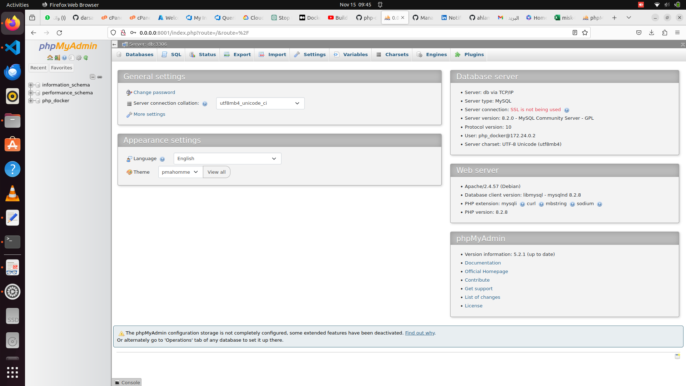

# docker-compose
Docker Compose is a tool for defining and running multi-container Docker applications using services.<br>
In this project <br>
1-I use db service to use mysql latest image to create database and configer password and user nameto it.
1-I use phpmy admin service to host db service and use its interface to add tables<br>
to run containair use command
```bash
docker-compose up
```
the command will creat container and run it on port 8081
```bash
http://0.0.0.0:8001/
```
 
 


