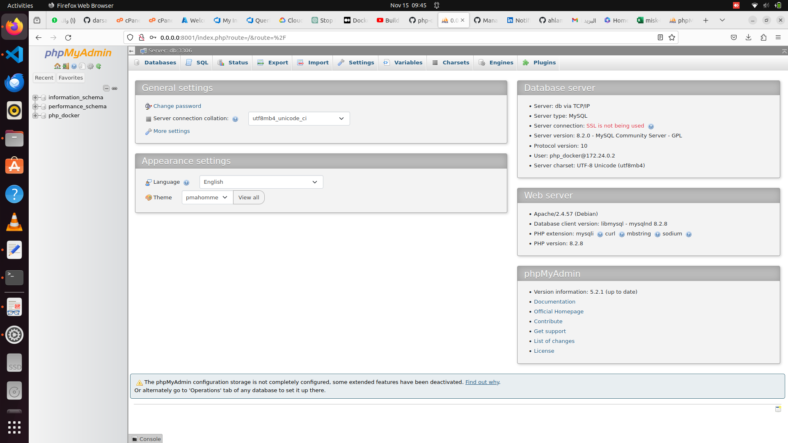

# docker-compose
Docker Compose is a tool for defining and running multi-container Docker applications using services.<br>
In this project <br>
1-I use db service to use mysql latest image to create database and configer password and user nameto it.<br>
2-I use phpmy admin service to host db service and use its interface to add tables<br>
to run containair use command
```bash
docker-compose up
```
the command will creat container and run it on port 8081
```bash
http://0.0.0.0:8001/
```
 
 
3-volums<br>
I create database using phpmyamin container.We all know once the container removed we lose all data <br>
to solve this we create volumes to map the  database from outside the container to the entiry point of the container
```yaml
 volumes:
      - "./db:/docker-entrypoint-initdb.d" 
```


